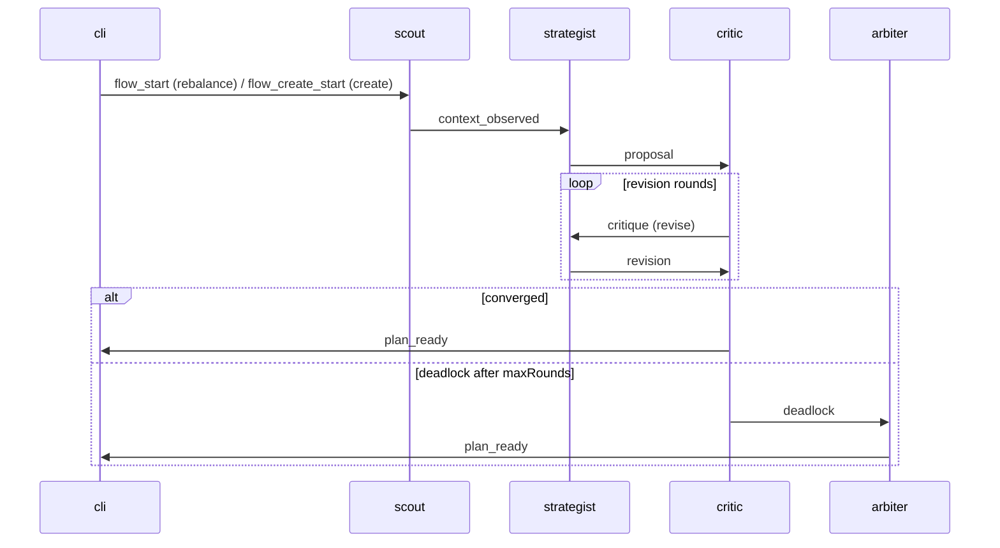

# AGENT.md

## What we are building

Zuno is a terminal-native Uniswap LP copilot.

A user runs:

- `zuno`

Then types plain English inside the shell, for example:

- create my zuno wallet
- inspect my positions
- inspect position 42
- create a position with 0.05 ETH passively   (brand-new LP via the four-agent debate)
- recommend what I should do with this position
- show me the diff
- simulate it
- approve it
- apply it
- explain recommendation
- refresh pools

Zuno is not a generic wallet chatbot.
It is a focused LP workflow tool, and the recommendation flow is a
**four-agent debate** over Gensyn AXL, not a single deterministic call.

## Product goals

Zuno should help a liquidity provider answer:

- what positions do I have
- which positions are out of range
- what does this position look like right now
- what rebalance should I consider
- *why* is that the recommendation (auditable debate, not opaque score)
- what changes if I apply that rebalance
- can I simulate it before signing

## Core interaction model

1. User launches `zuno`
2. User types plain English
3. Intent parser maps text to a structured intent
4. Direct tools handle deterministic reads and plan review
5. The recommendation intent kicks off a four-agent debate over AXL
6. Live `agent_thought` envelopes stream back to the CLI as transcript
7. Zuno renders concise, structured output with the transcript attached
8. User explicitly approves before Turnkey signs from the Zuno wallet

## Intents to support

### Wallet

- create my zuno wallet
- show my zuno wallet
- fund my zuno wallet
- show zuno wallet balance
- inspect my positions

### Position reads

- inspect a position
- inspect all positions
- check range status
- list out-of-range positions
- list risky positions

### Position creation

- create a brand-new LP position from prose ("create a position with 0.05 ETH passively")
- the parser extracts a CreateGoal: capital token + amount, risk profile,
  exposure preference, optional pinned pair / fee tier
- missing capital triggers exactly one clarification turn ("which token and how much?")
  before the four-agent debate fires
- never assume capital, chain, or pair - ask if not provided

### Recommendation

- recommend a rebalance
- show rebalance options
- explain why a recommendation was chosen (replays the debate transcript)
- refresh pools (re-probe the on-chain pool universe)

### Plan review and execution

- show the diff
- simulate the plan
- apply the plan

### Agent / network

- show agent status (lists scout, strategist, critic, arbiter availability)
- show peers
- show logs

## Which tasks use AXL

Use AXL only for recommendation-style flows and agent health visibility.

Use AXL for:

- recommend rebalance (the debate)
- show rebalance options (single-shot proposal call)
- agent status
- peers / agent visibility

Do not use AXL for:

- wallet balance
- listing positions
- inspecting positions
- range checks
- showing a saved diff
- basic simulation
- direct transaction signing

## The four agents

Each agent is an LLM with a distinct system prompt and toolset, plus a
deterministic fallback path. Numbers come from deterministic helpers
(stress sim, gas oracle, fee yield estimator); the LLM only owns
*reasoning*, never raw arithmetic.

### Scout

Responsible for:

- reading the LP position and pool state from chain
- loading realized volatility (CoinGecko, fallback deterministic seed)
- reading gas via `eth_gasPrice` for the position's chain
- estimating 24h fee yield from `liquidity × feeTier × in_range_share`
- classifying the regime: `ranging`, `trending`, `volatile`, `stressed`
- writing a one-paragraph regime summary in plain English
- emitting `context_observed` to Strategist

Scout owns the chain read (formerly Watcher's job). Folding it here
collapses one process and gives Scout the inputs it needs to label the
regime in the same turn.

### Strategist

Responsible for:

- reading Scout's `MarketContext`
- proposing 2-5 candidate ranges as `(widthMultiplier, centerOffsetTicks)` tuples
- snapping to the pool's `tickSpacing` and building real `PlanCandidate`s
  with `allocateInventory`
- emitting `proposal` (round 0) or `revision` (round > 0) to Critic
- revising in response to Critic's per-candidate suggestions

The LLM picks proportions; it cannot fabricate raw tick values. Width
multipliers are bounded `[0.3, 3.5]`. Center offsets are bounded.

### Risk-Critic

Responsible for:

- recomputing deterministic stress (1×, 2×, 3× vol) per candidate
- judging each candidate `accept` | `revise` | `veto` against the user's
  risk profile (`conservative` | `balanced` | `aggressive`)
- setting an overall decision: `accept`, `revise`, or `veto_all`
- on `accept` → emit `plan_ready` to CLI
- on `revise` → forward `critique` back to Strategist
- on no convergence after `ZUNO_MAX_DEBATE_ROUNDS` → emit `deadlock` to Arbiter

The Critic is intentionally adversarial. Veto is the strong move; revise
is the productive move; accept requires the numbers to clear the
profile floors.

### Arbiter

Responsible for:

- only firing on `deadlock`
- reading the entire debate (every proposal, every critique)
- picking exactly one candidate from the *latest* proposal
- setting verdict + confidence + paragraph rationale that quotes the debate
- honoring the user's risk profile as tiebreak axis
- emitting `plan_ready` to CLI with `decidedBy: "arbiter"`

## AXL flow

Recommendation flow:

Every agent also emits `agent_thought` envelopes back to the CLI as it
works. The CLI buffers these and renders them as the live debate
transcript under the recommendation card. The transcript is also
persisted into `plan.risk.reasons` so `explain recommendation` can
replay it later.

## Envelope kinds

All AXL kinds are typed in `packages/core/src/types/axl.ts`:

| kind | from | to | purpose |
|---|---|---|---|
| `flow_start` | cli | scout | start a rebalance |
| `flow_create_start` | cli | scout | start a brand-new position creation |
| `context_observed` | scout | strategist | regime + market context (or surveyed pools for create) |
| `proposal` | strategist | critic | initial candidate set |
| `critique` | critic | strategist | revise feedback per candidate |
| `revision` | strategist | critic | revised candidate set |
| `deadlock` | critic | arbiter | no convergence after maxRounds |
| `plan_ready` | critic\|arbiter | cli | final plan |
| `flow_failed` | any | cli | unrecoverable error |
| `agent_thought` | any | cli | live narration line |

## Three execution paths

The recommendation tool resolves which path at call time:

1. **Real AXL mesh** - if all four agent peers (scout, strategist,
   critic, arbiter) are visible on the local AXL topology, fan out a
   real four-process debate over the mesh.
2. **In-process orchestrator** - same four handlers, single Node
   process. Used when AXL nodes aren't running but
   `OPENAI_API_KEY` is set. Lives in
   `packages/strategy/src/agents/orchestrator.ts`.
3. **Deterministic** - the legacy `recommendPlan` math. Used only when
   no LLM is available, so demos still work without a key. Activated by
   missing `OPENAI_API_KEY` or `ZUNO_DETERMINISTIC=true`.

The mesh shape and message kinds are identical across all three paths.

## Tooling model

The model should not directly manipulate chain state.
Use tools.

### Direct deterministic tools

- wallet session tools
- wallet balance tools
- position fetch tools
- pool state tools
- range status tools
- risk-scoring helpers (stress, gas, yield, regime)
- diff renderer
- simulation builder
- transaction builder

### Agent tools

- start a debate (CLI sends `flow_start`)
- ping peers / inspect agent status
- read the running transcript

## Session state

Keep a small session memory in the shell:

- wallet address
- current chain
- last inspected position
- last generated plan
- signer mode
- last intent
- risk profile (`ZUNO_RISK_PROFILE`)

This allows references like:

- this position
- that plan
- apply it
- show me the diff
- explain recommendation

## Persistence

Default to minimal local state.
Store only what is necessary:

- latest plan (with the full debate transcript baked into `risk.reasons`)
- recent plan history
- request ids
- non-sensitive logs

Do not store:

- seed phrases
- raw private keys
- unnecessary personal data

## Wallet safety rules

- The terminal must not own the user's key by default.
- The personal wallet signs transactions in a wallet UI.
- Every state-changing transaction requires explicit user confirmation.
- Enclave signing is a separate mode.
- Enclave execution only works when onchain authority exists.

## Guardrails

- Never invent balances, fees, or prices.
- Never fabricate a position id.
- Never silently execute a transaction.
- Never treat a recommendation as guaranteed profit.
- Never hide uncertainty when data is incomplete.
- Never bypass onchain ownership rules.
- The LLM never owns arithmetic. Strategist proposes proportions; Critic
  scores against deterministic numbers; Arbiter picks an index bounded
  by the actual proposal.

## Coding expectations

- deterministic logic for anything financial
- clean boundaries between packages
- typed message contracts (`AxlEnvelope<T>`, `AxlKind`, all in core)
- structured errors
- testable modules (handlers separated from process entries)
- no bloated abstractions
- no stale package versions
- no deprecated patterns if a stable modern replacement exists

## File layout rules

For any source file beyond a thin entry point, do not pile constants, types, helpers, and the main implementation into one file. Split them out as soon as the file has more than the main implementation:

- **Constants** live in their own `constants.ts`. Always extract - even one shared constant goes here.
- **Types** live in their own `types.ts` when there are two or more, or when a type is referenced from another file. A single type used only in its own file can stay inline.
- **Helper / pure functions** live in their own `helpers.ts`. The main file should contain the public surface (the route handlers, the React component, the hook body, the executor) - not the small pure utilities they call.
- **Main file** contains the public surface only. It imports from `constants.ts`, `types.ts`, `helpers.ts`.

For the four agents specifically:

- `agents/<role>/index.ts` is the AXL process entry - `new AxlClient`, `client.listen()`, dispatch.
- `agents/<role>/handler.ts` is the pure handler the orchestrator and process entry both call.
- `agents/<role>/prompts.ts` is the system prompt + user-message builders.
- Optional `agents/<role>/lib/` for role-specific deterministic helpers.
- Cross-agent tools live in `agents/shared/lib/` (`stress.ts`, `gas.ts`, `yield.ts`, `regime.ts`).

Group these next to the main file (`apps/<app>/src/`, `packages/<pkg>/src/`, or in a `lib/` folder when the constants/helpers are reused across siblings inside the same app/package). Do not invent prefix-style names like `useShell-helpers.ts` or `proxy-types.ts` - use plain `helpers.ts` / `types.ts` / `constants.ts` next to or in `lib/`.

This rule applies to every new file in this repo. If you find yourself writing inline `const FOO = …`, `interface Bar {…}`, and `function helper() {}` blocks above the public surface in the same file, move them out before finishing the change.

## Design expectations

CLI:

- minimal
- premium
- readable
- lightly branded
- not noisy

The debate transcript should feel like reading a chat log, not a stack trace - short lines, role-tagged, every line ending in a number or a decision.

Landing page:

- minimalist
- restrained
- technical
- one clear pitch
- no clutter

## Quality bar

Code should be:

- clean
- modular
- scalable
- easy to reason about
- easy to test
- production-minded
- top-grade, not hacky

## Git workflow

### Branch naming

Use short, descriptive branch names with these prefixes:

- `feat/`
- `fix/`
- `refactor/`
- `docs/`
- `chore/`
- `test/`

Examples:

- `feat/four-agent-debate`
- `feat/critic-risk-profile`
- `fix/wallet-session-timeout`
- `refactor/intent-router`
- `docs/setup-guide`

### Commit message standard

Use lowercase, one-line, conventional-style commit messages.

Format:

- `feat(scope): message`
- `fix(scope): message`
- `refactor(scope): message`
- `docs(scope): message`
- `chore(scope): message`
- `test(scope): message`

Rules:

- use imperative mood
- keep it concise
- do not end with a period
- keep the subject line focused on one change
- prefer a clear scope when useful

Examples:

- `feat(agents): add scout regime classifier`
- `feat(critic): vary buffer floor by risk profile`
- `fix(arbiter): bound chosen index to proposal`
- `refactor(intents): simplify position reference resolution`
- `docs(readme): document four-agent debate flow`
- `test(stress): cover 1x/2x/3x vol projection ordering`

### Pull request requirements

Every PR should:

- pass CI
- pass typecheck
- pass lint
- pass tests
- keep documentation in sync when architecture or setup changes

Any PR touching these areas requires extra review:

- signer flows
- agent wallet lifecycle
- execution pipeline
- policy logic
- agent prompts (scout/strategist/critic/arbiter)
- deterministic risk helpers (stress/gas/yield/regime)
- protocol adapters
- AXL transport
- AXL message contracts (`AxlEnvelope<T>`, `AxlKind`, payload types)
- anything that can affect security or fund movement

### Review expectations

Before merging:

- confirm the change matches the intended package boundary
- confirm no sensitive wallet data is stored
- confirm financial logic remains deterministic (LLM never owns arithmetic)
- confirm no hidden execution path was introduced
- confirm naming and public interfaces stay clear and minimal
- confirm message contracts are typed end-to-end (no untyped `payload: unknown`)

## Definition of done

A task is done only when:

- the feature works end to end for its intended path (mesh, in-process, deterministic)
- typecheck passes
- lint passes
- relevant tests are added or updated
- docs are updated when setup, architecture, or behavior changed
- no obvious dead code or debug leftovers remain
- no known security regression was introduced
- public interfaces are named clearly and intentionally

## Dependency rules

- Prefer existing repo packages before adding a new dependency.
- Add a new dependency only with a clear reason.
- Avoid overlapping libraries that solve the same problem.
- Prefer small, maintained, stable packages.
- Remove unused dependencies quickly.
- Do not add heavy frameworks for narrow problems.
- Do not add a package when a small local utility is enough.
- Default to OpenAI / GPT for LLM features (the agents and the intent fallback both use `openai`).

## File and module rules

- Avoid large multi-purpose files.
- Split a module when responsibilities start to diverge.
- Keep public module APIs small and explicit.
- Prefer one clear responsibility per file.
- Avoid circular dependencies.
- Keep app entrypoints thin and orchestration-focused.
- Keep shared domain logic out of UI and transport layers.
- Agent process entrypoints (`agents/<role>/index.ts`) stay thin - the
  pure handler in `handler.ts` is the testable unit and is also what
  the in-process orchestrator calls.

## Logging rules

- Use structured logs where possible.
- Include request ids and plan ids in multi-step flows.
- Never log secrets, private keys, seed phrases, or sensitive session tokens.
- Never log full signed payloads if not necessary.
- Keep debug logging easy to disable.
- Log enough context to debug agent flows without leaking sensitive data.
- Agent thoughts (`agent_thought`) are log-equivalent and meant for the
  user - they must never include secrets, raw addresses beyond what
  Scout already shows, or full prompts.

## Environment and config rules

- Validate environment variables at startup.
- Document every required environment variable.
- Fail early on missing or invalid configuration.
- Do not read undeclared environment variables deep inside business logic.
- Keep configuration centralized.
- Separate dev/test/prod config clearly.
- Do not hardcode secrets, RPC URLs, or signer credentials.

Required for the agent debate:

- `OPENAI_API_KEY` (else falls back to deterministic)
- `ZUNO_AXL_{CLI,SCOUT,STRATEGIST,CRITIC,ARBITER}_PEER_ID`
- `ZUNO_AXL_{CLI,SCOUT,STRATEGIST,CRITIC,ARBITER}_API_URL` (defaults present)

Optional tuning:

- `ZUNO_AGENT_MODEL` (default `gpt-4o-mini`)
- `ZUNO_RISK_PROFILE` (`conservative` | `balanced` | `aggressive`, default `balanced`)
- `ZUNO_MAX_DEBATE_ROUNDS` (default 2)
- `ZUNO_DETERMINISTIC` (`true` to bypass the LLM)

## Inter-agent message contract rules

- All AXL messages must use typed schemas (`AxlEnvelope<T>` with a
  named payload type - no `unknown` payloads).
- Validate inbound and outbound payloads.
- Include a request id on every cross-agent flow.
- Keep message shapes minimal and explicit.
- Version message contracts if they change in a breaking way.
- Do not pass untyped raw blobs between agents.
- Keep transport metadata separate from domain payloads.
- New agent capabilities mean new `AxlKind` values, never new transport.

## Testing strategy

- Add unit tests for deterministic logic first.
- Test intent parsing with realistic plain-English inputs.
- Test the deterministic helpers (stress, gas, yield, regime) with explicit fixtures.
- Test critic veto logic with explicit risk profiles.
- Test diff rendering for stable output shape.
- Test transaction building and simulation inputs.
- Add integration tests for the in-process orchestrator (covers all four handlers).
- Avoid weak assertions that only check truthiness.

## Performance rules

- Keep `zuno` startup fast.
- Avoid blocking the interactive shell unnecessarily.
- Minimize repeated network calls.
- Cache only safe non-sensitive read data (gas oracle has 30s TTL, vol oracle has 5min TTL).
- Keep agent payloads compact.
- Stream or stage slower tasks when helpful.
- Do not trade correctness for minor speed gains in financial logic.
- Cap LLM rounds (`ZUNO_MAX_DEBATE_ROUNDS`) to bound debate latency.

## Release and change management

- Document breaking changes clearly.
- Make behavior changes in signer, execution, planner, or agent-prompt flows explicit.
- Avoid silent changes to security-sensitive paths.
- Keep migrations small and understandable.
- Update examples and setup docs when developer workflow changes.

## Do not merge if

- typecheck fails
- lint fails
- tests fail
- security-sensitive changes were not reviewed carefully
- docs are stale after an architectural change
- signer or execution logic became less explicit
- a new dependency was added without a clear reason
- agent prompts changed without a deterministic-fallback verification

## Module cohesion and file-splitting rules

- Do not split files too early.
- Prefer fewer, stronger modules over many tiny files.
- A new file must earn its existence through a real boundary of responsibility.
- Do not create one-function-per-file structures.
- Do not create wrapper files that add no real abstraction value.
- Avoid architecture theater: more files does not mean better architecture.
- For early-stage features, default to the smallest clean structure that keeps the full flow easy to read.
- Keep the main execution flow visible in one place whenever possible.
- Optimize first for readability, cohesion, and ease of change.
- Split a module only when:
  - responsibilities clearly diverge
  - logic is reused by multiple consumers
  - file size becomes genuinely hard to navigate
  - testing becomes awkward because unrelated concerns are mixed
- Before adding a new file, ask:
  - does this improve clarity in a meaningful way
  - is this a real boundary or just a helper extraction
  - would the feature be easier to understand if this stayed inline
- Prefer 1-3 files for small features unless there is a strong reason to do more.
- Keep full pipelines easy to trace end to end.
- Refactor into more files only after the feature proves stable and clearly grows.

## Simplicity-first implementation rule

When implementing a feature, optimize in this order:

1. readability
2. cohesion
3. low file count
4. clear data flow
5. extensibility

Do not optimize for abstract architecture too early.
