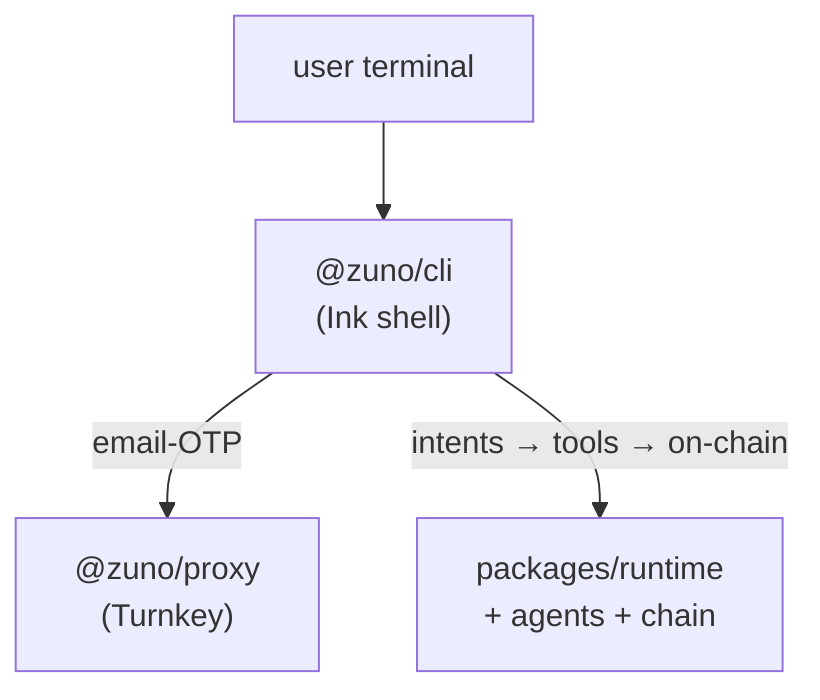

# apps

Deployable surfaces. Each is a workspace package under the `@zuno/*` namespace.

| app | what it ships |
| --- | --- |
| [`@zuno/cli`](./cli) | The `zuno` binary. Ink-based interactive shell that parses plain English, runs intents through `@zuno/runtime`, renders structured output, and holds the shell state (current wallet, last position, last plan, pending clarification). Entry point users actually touch. |
| [`@zuno/web`](./web) | Landing page. Next.js 16, App Router, Tailwind. Pitch + architecture diagram + live-debate transcript demo. Runs on `:3030`. |
| [`@zuno/docs`](./docs) | Mintlify documentation site. Sources the `.mdx` under `apps/docs/` (introduction, quickstart, CLI reference, architecture). Runs on `:3040`. |
| [`@zuno/proxy`](./proxy) | Cloudflare Worker (or local Node fallback) that fronts Turnkey's email-OTP API for the published CLI. Lets `npm install -g zuno` users sign in without holding parent-org Turnkey credentials. Self-hosters can skip it and point the CLI directly at Turnkey. |

## How they fit together

`@zuno/web` and `@zuno/docs` are independent of the runtime path; they're how prospective users learn about Zuno before installing the CLI.
