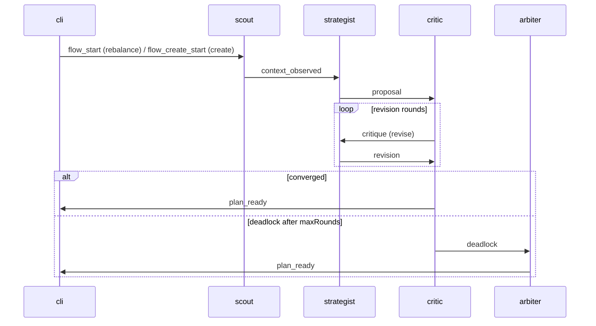

Zuno's mesh is **a debate**, not a pipeline.

A recommendation is the output of a four-agent argument: each agent is an
LLM with a distinct role, prompt, and toolset; numbers come from
deterministic helpers (chain reads, stress sim, gas oracle, fee yield
estimator); the model only owns *reasoning*, never raw arithmetic.

Convergence usually happens in 1-2 rounds. When it doesn't, an Arbiter
breaks the deadlock with the full transcript in hand.

## Scout

**Observes.** Reads the world and labels the regime.

Scout has two modes:
- **Rebalance mode**: listens for `flow_start`, reads one position from
  chain, classifies its regime.
- **Create mode**: listens for `flow_create_start`, surveys multiple
  pools via `discoverPools(chainId)` (real on-chain probe of the v4
  PoolManager), measures vol/gas/yield per pool, classifies each.

In both cases:

1. Reads chain state through viem.
2. Loads realized volatility (CoinGecko, fallback deterministic seed).
3. Reads gas via `eth_gasPrice` for the chain.
4. Estimates 24h fee yield from `liquidity × feeTier × in_range_share`.
5. Classifies regime: `ranging`, `trending`, `volatile`, or `stressed`.
6. Asks GPT to summarize *why* the regime is what it is, in plain English.
7. Forwards `context_observed` to Strategist (`MarketContext` for
   rebalance, `CreateContext` with `surveyedPools[]` for create).

Scout never proposes a range. It sets the world the next two agents act in.

## Strategist

**Proposes.** 2-5 candidate ranges, regime-aware. Two variants:

**Rebalance mode** asks GPT for `(widthMultiplier, centerOffsetTicks)`
tuples. Snaps each to the pool's `tickSpacing` and builds a real
`PlanCandidate` with `allocateInventory`.

**Create mode** asks GPT for `(poolIndex, widthMultiplier,
centerOffsetTicks, exposureBias)` tuples. The poolIndex points into
Scout's `surveyedPools`. `exposureBias = "long-token"` shifts the range
so the user's capital token sits more in the position; `"neutral"`
centers on current price for ~50/50 deposit. `allocateForCreate`
computes deposit amounts and surfaces a `prepAction` (e.g. "swap 0.4
WETH → USDC first") if the capital is single-sided.

Both modes:
- Stress-test every candidate (1×, 2×, 3× vol).
- Estimate yield per candidate so the rationale quotes real numbers.
- Forward `proposal` (round 0) or `revision` (round > 0) to Critic.

If Critic asks for a `revise`, Strategist gets the full critique back
and revises with `priorProposal` and `priorCritique` in context.

## Risk-Critic

**Challenges.** Default skeptical; vetoes are the strong move.

Listens for `proposal` and `revision` from Strategist. For each:

1. Recomputes deterministic stress (1×, 2×, 3×) and gas/yield ratios.
2. Asks GPT to judge each candidate as `accept` | `revise` | `veto`,
   honoring the user's risk profile (`conservative` | `balanced` |
   `aggressive`) - different floors on buffer hours and gas/yield.
3. Sets an overall decision: `accept` (one passes), `revise` (try again),
   or `veto_all` (every candidate failed at this vol/gas regime).
4. On `accept`: emits `plan_ready` direct to CLI, flow ends.
5. On `revise`: forwards `critique` back to Strategist; round counter increments.
6. After `ZUNO_MAX_DEBATE_ROUNDS` (default 2) without convergence:
   emits `deadlock` to Arbiter with the entire history.

## Arbiter

**Decides.** Only fires on deadlock.

Listens for `deadlock`. For each one:

1. Reads the full debate (every proposal, every critique, every judgment).
2. Asks GPT to pick exactly one candidate from the *latest* proposal,
   set a verdict, and write paragraph-length reasoning that quotes the
   debate by round.
3. Tiebreak axis honors the risk profile:
   - `conservative` → largest 2× vol buffer wins
   - `balanced` → best buffer × yield balance
   - `aggressive` → highest yield among non-vetoed candidates
4. Emits `plan_ready` to CLI with `decidedBy: "arbiter"`.

## Message lifecycle

Every agent also emits `agent_thought` envelopes back to the CLI as it
works. The CLI buffers these and renders them as the live debate
transcript under the recommendation card.

## When the LLM is unavailable

If `OPENAI_API_KEY` is unset or `ZUNO_DETERMINISTIC=true`:

- Scout falls back to a deterministic regime label from the same numbers.
- Strategist falls back to fixed multipliers (1.4×/0.65×/1.0×).
- Critic falls back to threshold rules (buffer floors, gas/yield ceilings).
- Arbiter falls back to a scored tiebreak (accept=3, revise=1, veto=-10).

The mesh shape and message kinds are identical. The CLI demo still works.

## Hallucination resistance

The LLMs in Zuno never produce numbers that hit chain. Four mechanisms keep
fabrication out of the plan:

1. **Bounded shape outputs.** Strategist returns `(widthMultiplier,
   centerOffsetTicks)` only - zod-validated, range-clamped. Real ticks come
   from `nearestUsableTick` snapping; real amounts come from
   `allocateInventory` / `allocateForCreate`. The model cannot invent a tick,
   an amount, or an address.
2. **Critic re-verifies, never trusts.** The Critic recomputes
   `stressProfile`, `gasYieldRatio`, and `rebalanceCostUsd` from the same
   on-chain inputs Scout used. Hard floors per `RiskProfile`
   (`BUFFER_FLOOR_HOURS`, `GAS_YIELD_CEILING`) reject candidates
   mechanically, regardless of the rationale.
3. **Disagreement detects drift.** A wrong proposal gets vetoed in the next
   round. A persistently wrong proposal triggers `deadlock` → Arbiter, who
   picks from concrete candidates by deterministic tiebreak. No single
   confidently-wrong agent can ship a plan unchecked.
4. **Schema-enforced structured outputs.** Every agent call uses OpenAI
   structured outputs with a zod schema. Malformed or out-of-range responses
   are rejected before they reach business logic.

The execution layer also requires explicit user approval before signing, so
even a plan that survived the debate cannot move funds until you type
`apply`.

## When AXL is unavailable

If the four agent peers aren't visible on the local AXL topology, the
CLI falls back to an in-process orchestrator (`runDebate`) that runs
the same four handlers in a single Node process. Same prompts, same
deterministic tools, same transcript - only the transport changes.
