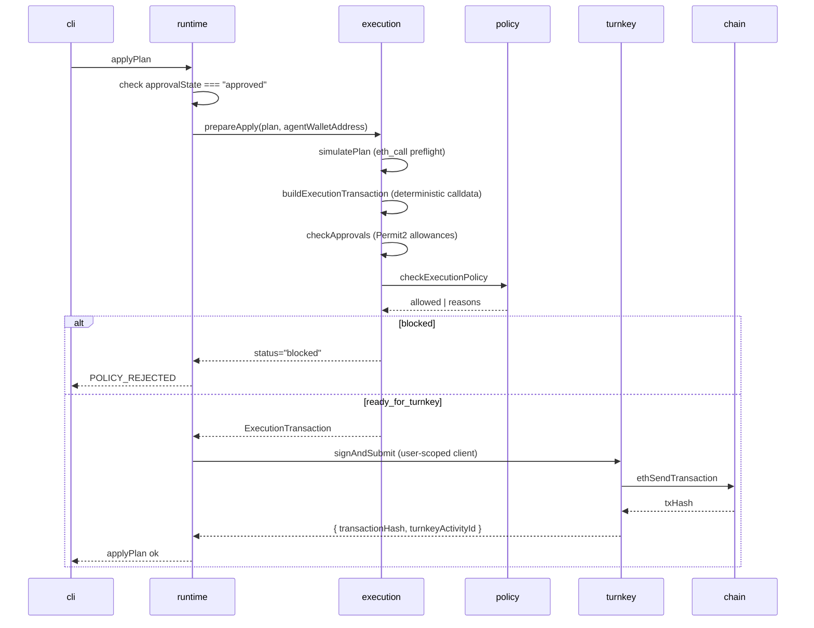

A debate produces a `Plan`. `apply` ships it. Between those two words sits
the execution pipeline: a deterministic gate that builds calldata, runs a
simulation, enforces a policy allowlist, and hands the transaction to
Turnkey for signing. The user never sees a wallet popup because there
isn't one to show. The CLI never holds a signing key.

This page traces what happens between the moment the user types
`apply` and the moment the transaction lands on chain.

## The user-facing flow

```
zuno                       # launches the CLI shell
login me@example.com       # one-time email-OTP sign-in
recommend rebalance        # the 4-agent debate produces a Plan
diff / simulate it         # optional: inspect the plan
approve it                 # arms the plan for signing (state flag, no signing)
apply                      # signs + submits via Turnkey
```

Six commands; one of them types a transaction onto chain. The rest are
inspection and consent.

## What happens on `apply`



Concretely, `applyPlan` (in `packages/runtime/src/tools/plan/index.ts`)
runs five gates in order. Any gate failing aborts the apply before
Turnkey sees the request.

### 1. Approval state

```ts
if (ctx.session.approvalState !== "approved") {
  return err("applyPlan", "APPROVAL_REQUIRED", 'Approve the plan first.');
}
```

The plan must be explicitly approved by the user via `approve it`. This
is a state flag on the session; no signing happens at approval time.

### 2. Deterministic transaction build

`buildExecutionTransaction` (in
`packages/execution/src/plans/transaction.ts`) builds the calldata from
the plan's tick math, not from anything the LLM produced:

```ts
const tx = buildRebalanceCalldata({
  position: plan.snapshot.position,
  liquidity,
  newTickLower: plan.recommended.tickLower,
  newTickUpper: plan.recommended.tickUpper,
  amount0Desired: plan.recommended.deploy0,
  amount1Desired: plan.recommended.deploy1,
  amount0Min: applySlippage(plan.recommended.deploy0, slippageBps(plan)),
  amount1Min: applySlippage(plan.recommended.deploy1, slippageBps(plan)),
  ...
});
```

The agents pick `(widthMultiplier, centerOffsetTicks)`. The execution
layer turns those into bytes.

### 3. On-chain simulation

`simulatePlan` runs an `eth_call`-style preflight against the live chain
state. Catches reverts before any signing happens. Estimates gas,
slippage, and the post-trade range.

### 4. Policy gate

`checkExecutionPolicy` (in `packages/execution/src/plans/policy.ts`)
enforces a hard allowlist before the transaction is allowed to leave
the runtime:

| Check | Reject reason |
|---|---|
| `plan.risk.verdict !== "reject"` | Risk agent rejected this plan |
| No inventory shortfall | Inventory prep is required (e.g. swap first) |
| `simulation.onchainStatus !== "failed"` | Onchain simulation failed: `<revert reason>` |
| All token approvals sufficient | Approve `<token>` for Permit2 before applying |
| `transaction.to` matches the allowlisted Position Manager | Transaction target is not the allowlisted Uniswap position manager |
| `transaction.value === 0` | Native value transfer is not allowed for LP rebalance execution |

If any of these fail, the apply returns `POLICY_REJECTED` with the
reasons. Nothing reaches Turnkey.

### 5. Turnkey sign + submit

Only if every gate passes does the runtime call:

```ts
const signed = await walletService(ctx).signAndSubmit(preview.transaction);
```

`signAndSubmit` (in `packages/chain/src/wallet/turnkey/client.ts`)
constructs a **user-scoped Turnkey client** using the session's
ephemeral keypair, then calls Turnkey's `ethSendTransaction`. Turnkey
verifies the request, signs with the user's sub-organization wallet,
and submits to the chain. The runtime gets back `transactionHash` and
`turnkeyActivityId` (Turnkey's audit trail id).

## Sign-in and session lifecycle

The signing setup happens once per hour, not per transaction.

1. User types `login <email>`. CLI calls Turnkey `initOtp` (directly
   for self-hosted; via `apps/proxy` for the npm-published binary).
2. Email arrives. User enters the OTP.
3. CLI generates a fresh **P256 ephemeral keypair locally**
   (`generateP256KeyPair`), hands the public key to Turnkey via
   `otpLogin`. Turnkey returns scoped session credentials
   (`apiPublicKey`, `apiPrivateKey`) bound to that ephemeral keypair.
4. First-time sign-in provisions a **Turnkey sub-organization** with
   its own wallet address. The wallet's signing key lives inside
   Turnkey's secure enclave; the parent organization has read-only
   access by Turnkey's architecture.
5. Session is persisted to `~/.zuno/session.json` with mode `0600` and
   a 1-hour TTL.

The CLI holds session API credentials. It does not hold the wallet's
signing key, ever.

## Security properties at a glance

| Property | Where enforced |
|---|---|
| User's signing key never leaves Turnkey | Turnkey sub-org isolates the wallet |
| Even Turnkey's parent org can't move funds | Sub-organization architecture |
| Session leak has limited blast radius | 1-hour TTL, mode `0600` on `~/.zuno/session.json` |
| LLM hallucinations cannot produce a transaction | Calldata built deterministically by `buildRebalanceCalldata` |
| No transaction without explicit user approval | `approvalState === "approved"` is required |
| Plan cannot target an arbitrary contract | Allowlist: `transaction.to === POSITION_MANAGER_BY_CHAIN[chainId]` |
| Plan cannot transfer native ETH | Policy rejects any `transaction.value > 0` |
| Plan cannot run if simulation reverts | `simulation.onchainStatus === "failed"` blocks apply |
| Plan cannot run if approvals are missing | `checkApprovals` blocks apply with a concrete remediation |

## What ships back to the user

`apply` returns a structured result the CLI renders as a confirmation
panel: plan id, position id, pair, fee tier, old and new range, gas
estimate, transaction hash, and the Turnkey activity id (so the user
can audit the request in their Turnkey dashboard).

## Where the code lives

- `packages/runtime/src/tools/plan/index.ts` - `applyPlan` tool
- `packages/execution/src/plans/apply.ts` - `prepareApply` pipeline
- `packages/execution/src/plans/transaction.ts` - calldata build
- `packages/execution/src/plans/policy.ts` - policy allowlist
- `packages/execution/src/plans/simulation.ts` - on-chain preflight
- `packages/chain/src/wallet/turnkey/client.ts` - `signAndSubmit`
- `packages/chain/src/wallet/turnkey/auth.ts` - OTP, session keys
