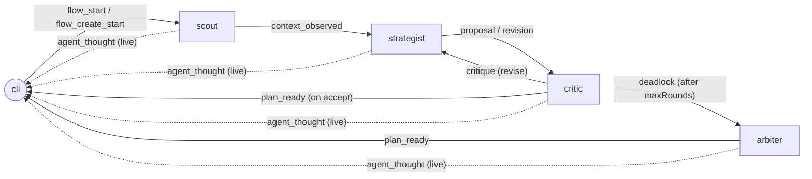

Every Zuno component, including the CLI, is an **AXL peer**. There is no
central orchestrator. A `recommend rebalance` run is a debate that
converges, not a pipeline that always runs the same length.

## Topology



All envelopes ride the AXL mesh (ed25519 peer ids, `/send` + `/recv`).

## Why this shape

A monolithic copilot black-boxes its reasoning - it makes a call and
tells you to trust it. By splitting the job across four processes that
*communicate* their intermediate state, the reasoning is auditable:
you can read the AXL log and see what each agent saw and what it sent.

The strategist↔critic loop is the heart of the design. It models the
real tension in LP management - fee density vs survival - as a
back-and-forth instead of a single scoring function. The arbiter is
the safety valve for when the loop won't converge.

## Envelope shape

Every message between peers is an `AxlEnvelope`:

```ts
type AxlEnvelope<T = unknown> = {
  requestId: string;     // correlates a full debate
  from: AgentRole;       // "cli" | "scout" | "strategist" | "critic" | "arbiter"
  to: AgentRole;
  kind: AxlKind;         // see below
  payload: T;
  ts: number;            // unix ms
};
```

`AxlKind` values:

- `flow_start` - cli kicks off a rebalance debate
- `flow_create_start` - cli kicks off a create-position debate
- `context_observed` - scout publishes regime + market context (or surveyed pools for create)
- `proposal` - strategist publishes initial candidates
- `critique` - critic asks strategist to revise
- `revision` - strategist responds with revised candidates
- `deadlock` - critic gives up, hands the debate to arbiter
- `plan_ready` - final structured plan back to cli
- `flow_failed` - unrecoverable error
- `agent_thought` - live narration line

The `kind` field is the contract between agents. New capabilities mean
new `kind` values, never new transport.

## Inbox / poll model

Peers pull from their own inbox via `GET /recv` on their local AXL node.
Zuno keeps the agent code behind `AxlClient`, so transport changes stay
isolated to the AXL package.

## Live transcript

Every agent emits `agent_thought` envelopes as it works - these are the
running narration the CLI renders under the recommendation card.
Thoughts are best-effort: dropping one never affects the structural
flow, because critic and arbiter both ride the running debate inside
their structural envelopes.

## What the monitor is (and isn't)

`packages/strategy/src/monitor/` is a separate background worker - **not**
an AXL peer, not part of the debate. It polls Uniswap v4 positions on a
fixed interval, runs deterministic risk thresholds (`isRiskyPosition`),
writes alerts to `~/.zuno/alerts.json`, and optionally pushes them to
Telegram. The shell sees the same alerts via `show alerts`.

The monitor sits next to the agents under `packages/strategy/src/`
because it shares the chain-read primitives (`listPositions`,
`buildSnapshot`, `riskReason`), but it never exchanges AXL envelopes
and never triggers the debate by itself. Acting on an alert is always
a manual `recommend rebalance → approve it → apply it`. See
[CLI / monitor](/cli/monitor).
