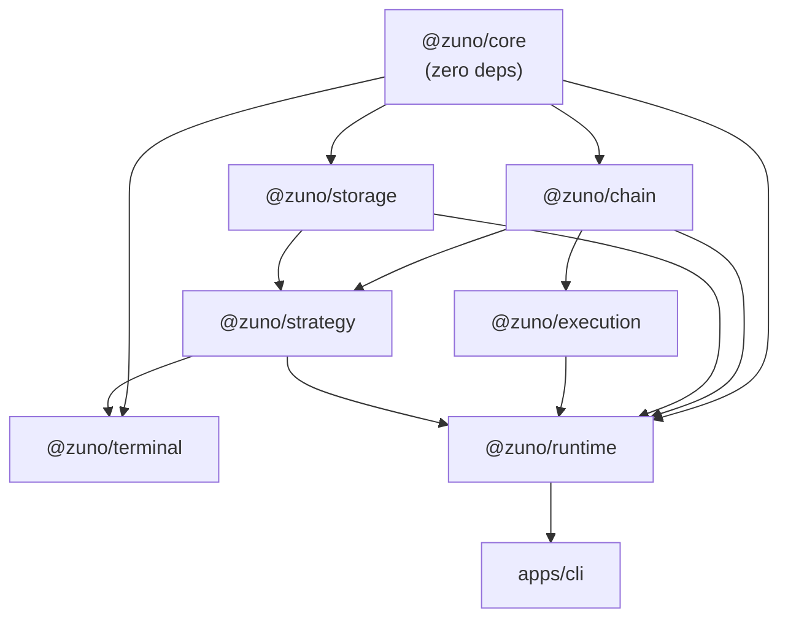

# packages

Workspace packages. Each is published under the `@zuno/*` namespace and consumed by `apps/cli` (and each other) via pnpm workspace links.

| package | what it owns |
| --- | --- |
| [`@zuno/core`](./core) | Pure types and id helpers. `Position`, `Pool`, `Plan`, `AxlEnvelope`, `CreateGoal`, `PreparedAction`, etc. No runtime dependencies, no I/O. Every other package depends on this one. |
| [`@zuno/chain`](./chain) | Everything that talks to a chain. Chain config + RPC, Turnkey-backed wallet service + email-OTP auth, Uniswap v4 reads (positions, pools, StateView), v4 calldata builders (mint, increase, decrease, collect, burn, rebalance multicall), Trading API swap quoting, ERC20 balances + allowances. |
| [`@zuno/storage`](./storage) | Local persistence behind small store interfaces. Plan store at `~/.zuno/plans/<id>.json`, alert store at `~/.zuno/alerts.json`, prepared-action store at `~/.zuno/actions/`. In-memory variants for tests. |
| [`@zuno/strategy`](./strategy) | The strategic brain. Four-agent debate (`scout`, `strategist`, `critic`, `arbiter`) over Gensyn AXL plus an in-process orchestrator fallback; deterministic planner primitives (candidates, critique, inventory allocation, plan diff); intent parser with deterministic rules + OpenAI fallback; the standalone background `monitor` worker. |
| [`@zuno/execution`](./execution) | The bridge between an approved plan and a signed transaction. Deterministic simulation preview, policy gate, prepared-tx builder. Never signs - that's the wallet boundary in `@zuno/chain`. |
| [`@zuno/runtime`](./runtime) | Intent → tool registry + executor. Each `ToolDefinition` maps an intent kind to a concrete action that returns `success`, `error`, or `needs_confirmation`. The CLI calls `executeIntent(intent, ctx)` and renders the result. |
| [`@zuno/terminal`](./terminal) | Ink renderer + theme. Panels, spinners, fields, ANSI palette. The CLI's view layer. |

## Dependency direction

Cycles are forbidden. If a downstream concept needs to leak upward, it goes into `core`.
